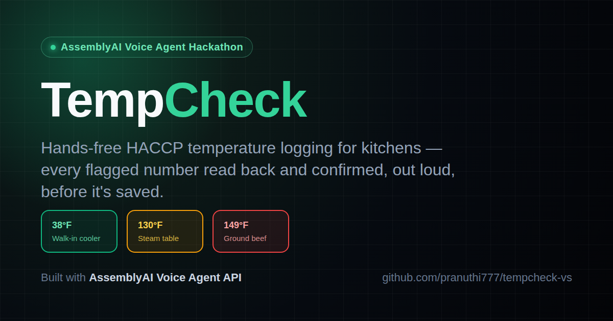
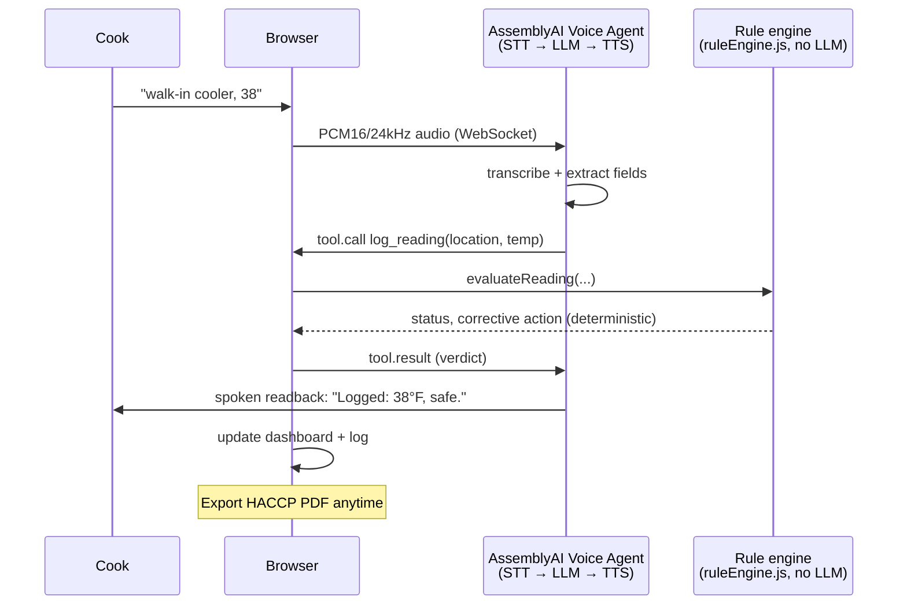

# TempCheck — hands-free voice food-safety logging



TempCheck is a voice agent for restaurant kitchens. A cook calls out a temperature reading while their hands are full ("walk-in cooler 38", "chicken breast 152", "steam table one twenty"), and TempCheck logs it, checks it against the FDA Food Code, and speaks back a confirmation — reading the exact number aloud so a misheard digit gets caught immediately, not at the next health inspection.

Built for the [AssemblyAI Voice Agent Hackathon](https://lablab.ai/ai-hackathons/assemblyai-voice-agent-hackathon) on lablab.ai.

## Why this exists

A misheard "38°F" logged as "48°F" is a food-safety failure, not a UX nitpick. Two design decisions follow directly from that:

1. **The safety verdict is never up to the language model.** A plain, deterministic rule engine (`src/lib/ruleEngine.js`) checks every reading against published FDA Food Code limits. The voice agent's job is only to extract the spoken numbers and speak the verdict back — it never decides what's safe.
2. **Every flagged number gets read back and confirmed**, and the cook can correct themselves mid-sentence ("38 — no wait, 48") before it's logged.

## Architecture



The rule engine is deliberately outside the LLM's control: the agent extracts fields
and speaks, but a plain numeric comparison against FDA Food Code limits decides safe
vs. amber vs. red every time.

- **`src/app/api/token/route.js`** — server-side only; mints a short-lived AssemblyAI session token so the real API key never reaches the browser.
- **`src/lib/agentConfig.js`** — the system prompt and the `log_reading` tool schema sent to the agent.
- **`src/lib/useVoiceAgent.js`** — owns the WebSocket lifecycle: mic streaming, playback, tool-call handling, transcript captions, barge-in/interruption handling.
- **`src/lib/ruleEngine.js`** + **`src/lib/foodCategories.js`** — the actual safety logic. Zero LLM calls. Fully unit tested (`npm test`).
- **`src/lib/haccpPdf.js`** — generates the inspector-ready HACCP log PDF from the exact readings captured in the session.

## Running it locally

```bash
npm install
cp .env.example .env.local   # add your AssemblyAI API key
npm run dev
```

Open `http://localhost:3000`, click **Start Shift**, allow microphone access, and call out a reading.

## Tests

```bash
npm test
```

22 tests: every FDA category, boundary values, unit conversion, unrecognized items, implausible readings, non-numeric input, and the STT-transcript number parser used by the accuracy harness below.

## Measured accuracy

See [`docs/accuracy.md`](docs/accuracy.md) for the real, measured number-capture accuracy against a 270-clip noisy-kitchen test set (method disclosed there) — no invented statistics. The harness (`/dev/accuracy-test`) runs every clip through AssemblyAI's real transcription API; nothing is mocked or estimated.

## Known limitations (stated plainly, not hidden)

- The accuracy test set is synthesized (TTS voices + procedurally generated noise), not real kitchen recordings — see `docs/accuracy.md` for why, and how to regenerate/verify it yourself.
- Cooling-curve tracking (135°F→70°F within 2h, then →41°F within another 4h) is not yet automated; only point-in-time readings are checked so far.
- No persistent storage yet — a shift's log lives in the browser tab for the session and is exported as a PDF before ending the shift.

## Status

Actively being built through the hackathon deadline (Sep 30, 2026, 12:00 PM ADT). See the commit history for real-time progress — nothing here is written after the fact.
