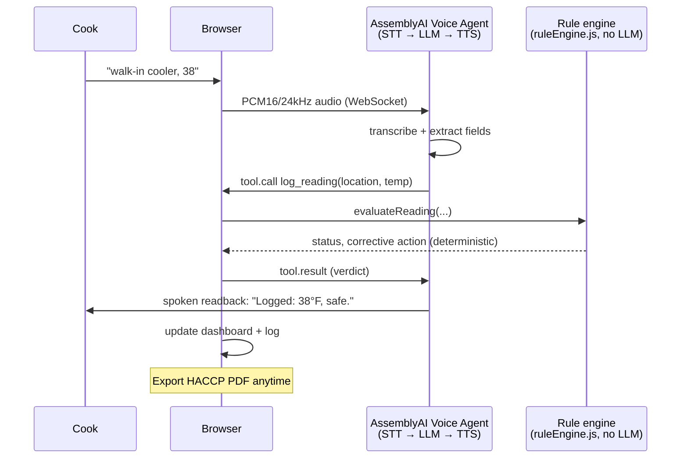

# TempCheck — hands-free voice food-safety logging


TempCheck is a voice agent for restaurant kitchens. A cook calls out a temperature reading while their hands are full ("walk-in cooler 38", "chicken breast 152", "steam table one twenty"), and TempCheck logs it, checks it against the FDA Food Code, and speaks back a confirmation — reading the exact number aloud so a misheard digit gets caught immediately, not at the next health inspection.

Built for the [AssemblyAI Voice Agent Hackathon](https://lablab.ai/ai-hackathons/assemblyai-voice-agent-hackathon) on lablab.ai.

## Why this exists

A misheard "38°F" logged as "48°F" is a food-safety failure, not a UX nitpick. Two design decisions follow directly from that:

1. **The safety verdict is never up to the language model.** A plain, deterministic rule engine (`src/lib/ruleEngine.js`) checks every reading against published FDA Food Code limits. The voice agent's job is only to extract the spoken numbers and speak the verdict back — it never decides what's safe.
2. **Every flagged number gets read back and confirmed**, and the cook can correct themselves mid-sentence ("38 — no wait, 48") before it's logged.

## Architecture



The rule engine is deliberately outside the LLM's control: the agent extracts fields
and speaks, but a plain numeric comparison against FDA Food Code limits decides safe
vs. amber vs. red every time.

- **`src/app/api/token/route.js`** — server-side only; mints a short-lived AssemblyAI session token so the real API key never reaches the browser.
- **`src/lib/agentConfig.js`** — the system prompt and the `log_reading` tool schema sent to the agent.
- **`src/lib/useVoiceAgent.js`** — owns the WebSocket lifecycle: mic streaming, playback, tool-call handling, transcript captions, barge-in/interruption handling.
- **`src/lib/ruleEngine.js`** + **`src/lib/foodCategories.js`** — the actual safety logic, covering cold/hot holding, poultry, ground/injected meat, whole-muscle meat, fish/seafood/eggs, and reheating, each citing its specific FDA Food Code section. Zero LLM calls. Fully unit tested (`npm test`).
- **`src/lib/coolingEngine.js`** — the two-stage cooling curve (135°F→70°F within 2h, then →41°F within 6h total, FDA 3-501.14(A)), pairing a spoken "cooling start" reading with a later "cooling check" for the same item.
- **`src/lib/haccpPdf.js`** — generates the inspector-ready HACCP-style log PDF: a letterhead-style header, a dedicated "Corrective Actions & Violations" section listing every amber/red reading with its FDA citation and the cook's exact spoken words as evidence, the full log, page numbers, and a manager sign-off line. Exportable filtered by date and by station/item from the dashboard.
- **`src/lib/audioCues.js`** + **`src/components/BigDisplay.js`** — hands-free extras: a beep on every log (a distinct alert tone for amber/red), and a full-screen, glanceable big-display mode. Push-to-talk (for loud kitchens) lives in `useVoiceAgent.js`.
- **`src/lib/micCapture.js`**'s `startDemoCapture` + **`public/demo/`** — the no-mic "Try Demo" mode: feeds a pre-recorded sample clip through the exact same AudioWorklet/WebSocket pipeline a real microphone uses, so nothing about the agent's response is scripted.
- **`src/lib/correctionTracker.js`** — links a reading to an immediately-prior one for the same location/food_item within a 45s window, so a cross-turn correction ("wait, that's wrong, it's 48") never leaves a stale entry sitting next to its own fix. Fully unit tested.
- **`src/lib/hashChain.js`** + **`src/app/api/log-timestamp/route.js`** — the tamper-evident log: a SHA-256 hash chain across every entry (each depends on the one before it) plus a server-issued timestamp per entry. Fully unit tested. See "Tamper-evident log" below for exactly what this proves and what it doesn't.
- **`src/lib/foodCategories.js`**'s `categoryConflict` — the deterministic code mapping from food_item/location always wins over the agent's own guessed `reading_type`; a disagreement is flagged (dashboard + PDF) for a manager's review, never silently overridden by the LLM.

## Running it locally

```bash
npm install
cp .env.example .env.local   # add your AssemblyAI API key
npm run dev
```

Open `http://localhost:3000`, click **Start Shift**, allow microphone access, and call out a reading.

No mic handy, or just want to see it work first? Click **🎬 Try Demo (no mic needed)** instead — it plays a ~30-second sample kitchen recording through the exact same real pipeline (real AssemblyAI transcription, real rule-engine verdicts, real spoken confirmations) with no microphone access needed. See "First-60-seconds demo mode" below.

## Tests

```bash
npm test
```

62 tests: every FDA category and its binary amber/red boundaries (amber sits entirely on the compliant side of each limit — see the note in `ruleEngine.js`), the freezer category, code-wins-over-LLM category resolution and conflict flagging, cross-turn correction linking, the tamper-evident hash chain, unit conversion, unrecognized items, implausible readings, non-numeric input, and the STT-transcript number parser used by the accuracy harness below (including regression tests for real parsing bugs the accuracy runs themselves caught — see `docs/accuracy.md`).

## First-60-seconds demo mode

Judges reviewing dozens of submissions shouldn't need a working microphone or a quiet room to see this work. The **🎬 Try Demo** button on the live site plays a pre-recorded, synthesized (`espeak-ng`) sample kitchen conversation — a safe cold-holding reading, a flagged poultry reading with a corrective action, a mid-sentence self-correction, and a borderline amber reading (`public/demo/manifest.json` documents the exact script and expected outcome for each) — straight through the app's real microphone-capture pipeline (`src/lib/micCapture.js`'s `startDemoCapture`) via the same AudioWorklet used for a real mic. Nothing about the response is scripted or faked: the real AssemblyAI Voice Agent transcribes it, the real deterministic rule engine (`src/lib/ruleEngine.js`) evaluates it, and the real UI — status board, spoken confirmation, Manager Summary, log — updates from real tool calls, exactly as it would for an actual cook. Demo readings are clearly badged "Demo mode" and are never persisted to (or allowed to overwrite) a real saved shift.

## Measured accuracy

See [`docs/accuracy.md`](docs/accuracy.md) for the real, measured number-capture accuracy against a 648-clip noisy-kitchen test set (method disclosed there) — **570/648 (88.0%)**, no invented statistics, covering standard kitchen noise, 4 accents, fast speech, and 4 additional real-kitchen noise types (fryer, hood fan, dishwasher, a shouting coworker). The harness (`/dev/accuracy-test`) runs every clip through AssemblyAI's real transcription API; nothing is mocked or estimated. `docs/accuracy.md` shows exactly what real bugs each run caught and fixed, the full breakdown by test group and noise condition, and why the remaining misses are genuine STT/synthesis limitations, not code bugs.

## Real end-to-end verification

Beyond unit tests, the live deployment was driven with real synthesized speech through the actual production AssemblyAI Voice Agent WebSocket (no text-injection shortcuts, no mocks): a normal safe reading, a flagged out-of-range poultry reading (with the corrective-action dialogue), a mid-sentence self-correction, an unrecognized item (clarifying-question path), and barge-in (talking over the agent mid-sentence) all produced correct tool calls, correct FDA rule-engine verdicts, correct spoken readbacks, and correct interruption handling (`reply.done: interrupted`, playback flushed) against the real backend.

## Tamper-evident log

Every logged reading is linked into a SHA-256 hash chain (`src/lib/hashChain.js`): each entry's hash is computed from its own content plus the previous entry's hash, so editing, reordering, or deleting an entry after the fact breaks the chain from that point forward. Each entry also carries a server-issued timestamp (`src/app/api/log-timestamp/route.js`, a tiny Vercel serverless function — harder for a client to fake than trusting the browser's own `Date.now()` alone) and the cook's verbatim spoken transcript. A **🔒 Verify Log Integrity** button on the dashboard, and a "Log integrity: VERIFIED / BROKEN" line on every exported PDF, recompute the chain and report whether it's intact.

**What this does and doesn't prove, stated plainly:** this is a "this is what was said, in this order, at this time" guarantee — it is *not* proof that a thermometer probe actually touched food at the stated temperature (a voice log fundamentally can't prove that; a cook could still misread or lie to a working probe). It's also not a cryptographic timestamp authority or a persistent server-side audit store — this app has no backend database, so the log still lives in the browser (`localStorage`) until exported, and someone with full control of their own browser (devtools, editing `localStorage` directly) could in principle fabricate an entirely new, internally-consistent chain from scratch before ever exporting. What it *does* catch, and the realistic threat it's aimed at, is the far more common case: editing or deleting an entry from an *existing* log after the fact (e.g. changing a 152°F chicken-breast violation to a compliant number after the shift, hoping nobody notices) — any such edit is detectable, because it breaks the chain from that entry forward.

Two related, real limitations of the underlying AssemblyAI Voice Agent API, confirmed directly against its own published docs: neither `transcript.user` nor `transcript.user.delta` includes a confidence score, and there is no word-level timing data on the final transcript. So per-word timing information — which would have made this stronger evidence of *when* each word was spoken, not just each full utterance — isn't available to build on top of this API as documented today; the verbatim transcript and its utterance-level server timestamp are what's actually achievable and honestly claimed here.

Corrections are handled the same honest way: a cook correcting an earlier reading in a later turn (`src/lib/correctionTracker.js`) never rewrites or deletes the original hash-chained entry — it adds a new entry with an audit note ("Corrected from 38°F (amber) by cook at 08:47") and marks the original "superseded" for display, while both remain in the chain exactly as logged.

## Known limitations (stated plainly, not hidden)

- Talking over the agent immediately after it starts speaking (barge-in) can occasionally make AssemblyAI's STT blend a word from the interrupted reply into the next utterance — confirmed against the real API, not something our code causes or can fully correct. The mandatory readback still catches it before anything wrong is logged.
- Mid-sentence self-corrections ("steam table, 120 — no wait, 140") are transcribed correctly by AssemblyAI almost every time, but the live agent's own field extraction occasionally still logs the *first* number instead of the corrected one, even when the system prompt explicitly says to use the last number stated — confirmed live, on the exact same real transcript, in two separate runs (one correct, one not). This is a probabilistic LLM-extraction limitation, not a bug in our deterministic code (the offline accuracy harness's own parser, `parseTemperatureFromText.js`, gets this right consistently — see `docs/accuracy.md`). The prompt has been strengthened to reduce this, and either way the mandatory spoken readback still catches it before anything wrong is left uncorrected — but it's not eliminated.
- The accuracy test set is synthesized (TTS voices + procedurally generated noise), not real kitchen recordings — see `docs/accuracy.md` for why, and how to regenerate/verify it yourself.
- A few STT mis-transcriptions in the accuracy set involve the TTS voice leaving a number partly spelled out (e.g. "one 45" instead of "145"); recovering that would need English-number-word parsing, not just a regex fix — noted rather than patched under deadline pressure (see `docs/accuracy.md`).
- Continuous background noise (a running hood fan, a dishwasher, steady kitchen hiss) is handled well; transient, speech-like noise (a fryer basket going in, a shouting coworker) is noticeably harder for the STT — measured at 52.8% and 47.2% respectively vs. 88–100% for steadier noise types (see `docs/accuracy.md`).
- Cooling-curve tracking (135°F→70°F within 2h, then →41°F within 6h total — FDA Food Code 3-501.14(A)) is automated (`src/lib/coolingEngine.js`, unit tested), but pairs only a start and one later check reading — it assumes temperature only decreased in between rather than independently confirming an intermediate point, and the pending "cooling in progress" state lives only for the current session (not saved across a reload, unlike the rest of the shift log).
- Shift persistence is local to one browser (localStorage) — it survives a reload or crashed tab on the same device, but not a switch to a different device or a cleared browser profile; no multi-device or multi-user backend yet.
- The internal `/api/dev/transcribe` accuracy-harness endpoint is off by default in any fresh deployment (`ENABLE_DEV_HARNESS` must be explicitly set) and rate-limited per IP when enabled — not linked from the cook-facing UI, and not reachable at all without that env var set.

## Status

Actively being built through the hackathon deadline (Sep 30, 2026, 12:00 PM ADT). See the commit history for real-time progress — nothing here is written after the fact.
